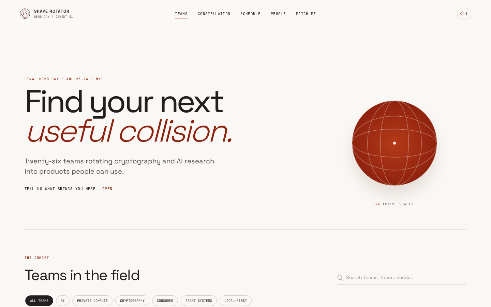

# Shape Rotator Demo Day Field Guide

A mobile-first visitor field guide for Shape Rotator Accelerator Cohort 01 final demo day. Explore all 26 teams and 52 people, inspect the cohort's dependency constellation, review the curated Jul 23–24 program, save promising teams, and get matched to useful conversations through a private client-side questionnaire. The app is a small static Vite build with cohort data compiled from the public [`shape-rotator-os`](https://github.com/dmarzzz/shape-rotator-os) records at build time, with no backend or runtime data fetching.

**Live:** [0xsolace.github.io/shape-rotator-demo-day](https://0xsolace.github.io/shape-rotator-demo-day/)



## Local development

```bash
npm install
npm run dev
```

`npm run build:data` parses Markdown frontmatter, YAML, and calendar JSON from `cohort-data/` into a single static `src/data/cohort.json` bundle. `npm run build` regenerates that bundle and emits the production site to `dist/`.
